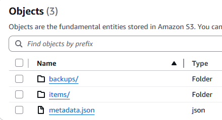

<div align="center">💗 <a href="https://buymeacoffee.com/itcon">Countless hours have gone into coding this extension. If you found this useful, please consider donating so that I stay motivated to build and release  such awesome tools for free.</a> 💗<br/><br/><a href="https://buymeacoffee.com/itcon"></a></div>
<br/>
<div align="center">

**Quick Navigation**

[Key Features](#-key-features) •
[Installation & Setup](#-installation--setup) •
[Migration to V3](#-migration-to-v3) •
[Operating Modes](#-operating-modes) •
[Using the Extension](#-using-the-extension) •
[Cloud Storage Setup](#️-cloud-storage-setup) •
[Troubleshooting](#-troubleshooting)

</div>

# TypingMind Cloud Sync V3

A comprehensive cloud backup and sync extension for TypingMind that automatically backs up and synchronizes your entire TypingMind data with AWS S3 or S3-compatible cloud storage services.

## ✨ Key Features

### 🔄 **Intelligent Sync System**

- **Bidirectional Sync**: Real-time synchronization between your local TypingMind data and cloud storage.
- **Multi-Tab Safe**: Uses a leader election system to ensure only one browser tab performs sync operations, preventing conflicts.
- **Deletion Tracking**: Advanced tombstone system tracks deletions across devices to prevent data loss.
- **Conflict Resolution**: Smart conflict resolution when the same data is modified on multiple devices.
- **Auto-sync**: Configurable automatic sync intervals (minimum 15 seconds).

### 💾 **Efficient Backup Management**

- **Daily Automated Backups**: Automatic daily backups with a 30-day retention period, created efficiently on the server side.
- **On-demand Snapshots**: Create named snapshots of your current cloud data instantly.
- **Server-Side Operations**: Backups and snapshots are created using fast server-side copies, minimizing local resource usage and upload times.
- **Smart Cleanup**: Automatic cleanup of old daily backups and tombstones.

### 🔒 **Security & Encryption**

- **AES-GCM Encryption**: All data encrypted client-side with 256-bit keys before being sent to the cloud.
- **Strong Key Derivation**: Encryption keys are derived from your password for enhanced security.
- **No Plaintext Storage**: Your data is never stored unencrypted in the cloud.

### 🛠 **Flexible Configuration**

- **URL Parameters**: Configure via URL for easy setup across multiple devices.
- **NoSync Mode**: A snapshot-only mode for when you don't need real-time synchronization.
- **Auto-configuration**: Automatic setup from URL parameters on first launch.
- **Exclusion Lists**: Customize what data to exclude from sync.

### 📊 **Monitoring & Debugging**

- **Sync Diagnostics Panel**: A dedicated UI panel to monitor the health of your sync, comparing local and cloud item counts.
- **Comprehensive Logging**: Detailed console logging for advanced troubleshooting even in mobile browsers.
- **Sync Status Indicator**: Visual sync status icon in the UI.
- **Operation Queue**: Robust background operation handling with automatic retries for failed tasks.

## 🚀 Installation & Setup

### Prerequisites

⚠️ **Important**: Before installing, it's always a good practice to export your TypingMind data via "Settings > App Data & Storage > Export" as a local backup.

### Step 1: Install the Extension

1. Go to **Menu > Preferences > Extensions** in TypingMind.
2. Load this URL: `https://itcon-pty-au.github.io/typingmind-cloud-backup/s3-v3.js`

### Step 2: Configure Cloud Storage

After installation, you'll see a new **Sync** button in the sidebar. Click it to open the configuration modal.

> **First Time Setup**: If you haven't configured the mandatory fields (bucket name, region, access key, secret key, encryption key), the extension will show an alert prompting you to configure these settings. The extension needs these credentials to function.

**Required Fields** (marked with \*):

- **Bucket Name\*** - Your S3 bucket name.
- **Region\*** - AWS region (e.g., `us-east-1`; use `auto` for Cloudflare R2).
- **Access Key\*** - Your S3 access key ID.
- **Secret Key\*** - Your S3 secret access key.
- **Encryption Key\*** - Your personal encryption password. **If you forget this key, your data cannot be recovered.**

**Optional Fields**:

- **S3 Endpoint** - For S3-compatible services (e.g., iDrive E2, Wasabi). Leave empty for AWS S3.
- **Sync Interval** - How often to sync in seconds (minimum 15, default 15).
- **Exclusions** - Comma-separated list of additional keys to exclude from sync.

  > **Note**: System keys (starting with `tcs_`) and sensitive keys are automatically excluded.

### Step 3: Quick Setup Options

#### Option A: Manual Configuration

1. Click the **Sync** button in the navigation menu.
2. Fill in your cloud storage credentials in the modal.
3. Click **Save**. The extension will verify credentials, and if successful, perform an initial sync.
   - If cloud is empty, it will upload your local data.
   - If local data is empty but cloud has data, it will restore from the cloud.
   - It will then start automatic sync and daily backups.

#### Option B: URL Configuration (Recommended for multiple devices)

Add parameters to your TypingMind URL for automatic setup. This is useful for quickly configuring a new browser or device.

```
https://your-typingmind-url.com/?bucket=your-bucket&region=us-east-1&accesskey=your-key&secretkey=your-secret&encryptionkey=your-password&config
```

**Available URL Parameters**:

- `bucket` - S3 bucket name
- `region` - AWS region
- `accesskey` - Access key ID
- `secretkey` - Secret access key
- `endpoint` - S3 endpoint (for compatible services)
- `encryptionkey` - Encryption password
- `syncinterval` - Sync interval in seconds
- `exclusions` - Comma-separated exclusion list
- `config` or `autoconfig` - Auto-open the config modal on load.
- `log` - Enable console logging from startup.
- `nosync` - Enable NoSync mode (snapshots only).

## 🎛 Operating Modes

### Standard Sync Mode (Default)

- Full bidirectional synchronization.
- Automatic deletion tracking and conflict resolution.
- Real-time sync across devices.
- Best for users with multiple devices who want seamless data consistency.

### NoSync Mode

Add `?nosync` to your URL to enable this mode.

- Disables all automatic sync operations (including daily backups).
- The **Sync Now** button is disabled.
- Only allows for manual creation of on-demand snapshots.
- Ideal for users who prefer manual control over their backups.

## 📱 Using the Extension

The sync modal is your central hub for managing backups and settings.

### Backup Management

The **Available Backups** section shows all your cloud backups.

**Backup Types**:

- 📸 **Snapshots** (`s-` prefix) - Manually created, named backups of your data at a specific point in time.
- 🗓️ **Daily Backups** (`typingmind-backup-` prefix) - Automatic daily backups.

**Actions**:

- **Restore** - Restores the selected backup. **This overwrites all current cloud data with the backup's contents** and will trigger a full sync to your local machine.
- **Delete** - Permanently removes the selected backup from your cloud storage.

### Sync Diagnostics

This panel provides a quick overview of your sync status. It helps identify discrepancies between your local data and cloud data.

- **Local Items**: The number of items (chats, settings, etc.) in your browser.
- **Local Metadata**: The number of items tracked by the extension's local metadata file.
- **Cloud Metadata**: The number of items tracked in the cloud.
- **Chat Sync**: A comparison of local vs. cloud chat counts.

Ideally, all counts should match after a successful sync.

### Manual Operations

- **Save** - Saves your configuration and triggers a sync.
- **Sync Now** - Manually triggers a full synchronization cycle.
- **Snapshot** - Creates a named snapshot of the current data in the cloud.
- **Console Logging** - Toggle detailed logging in the browser console for troubleshooting.

### Sync Status Indicator

The sync button in the sidebar shows a colored dot indicating the current status. The dot is only visible when the extension is configured and has performed a sync operation.

- 🟢 **Green** - Sync successful. The dot will remain green while idle.
- 🔴 **Red** - A sync error occurred. Check the browser console for details.
- 🔵 **Blue** - Sync in progress.

## 🚀 Migration to V3

V3 is a major rewrite and is **not backward compatible** with backups created by older versions (V1 or V2).

#### What to Expect During Migration

When you load the V3 extension for the first time, the process is largely automatic:

- **Your Data is Safe**: Your existing local TypingMind data (chats, folders, etc.) is preserved and used as the source for the first sync.
- **Automatic Configuration Upgrade**: Old configuration keys from V2 are automatically read and used.
- **New Cloud Structure**: V3 uses a new, more efficient data structure in your S3 bucket. Old extension files and backups are ignored.
- **First Sync**: The extension will treat your current local data as the source of truth and upload it to the new cloud structure.

#### ⚠️ Important Compatibility Notes

- **Old Backups Are Incompatible**: Backups created with V1 or V2 **cannot be restored** using V3. It is recommended to delete old backup files from your S3 bucket.
- **One-Way Upgrade**: The process is a one-way upgrade. You cannot revert to an older version without potentially causing data sync issues.

There is no manual data migration required—the extension handles everything automatically on the first load. Just install, configure, and let it work.

#### Recommended Migration Steps

1.  **Backup Data**: In TypingMind, go to **Settings > App Data & Storage > Export**. Select all checkboxes and download the file. Keep it in a safe place.
2.  **Remove Old Version**: Go to **Settings > Extensions** and remove the V1/V2 extension.
3.  **Install V3**: Load the V3 extension URL: `https://itcon-pty-au.github.io/typingmind-cloud-backup/s3-v3.js`.
4.  **Configure**: Open the **Sync** modal. Your previous settings should be pre-filled. Enter your **Encryption Key** again and click **Save**.
5.  **Verify**: The first sync will begin. You can monitor its progress in the browser console (enable logging for more detail) and by using the **Sync Diagnostics** panel.

### Understanding the V3 File Structure

To help you safely clean up old files from previous versions, here is a breakdown of the file structure used by V3 in your S3 bucket. Any files or folders not matching this structure are likely from an older version and can be removed.

- **`metadata.json`**: This is the most critical file for synchronization. It acts as the central index for all your data, tracking every item's sync status, version, and deletions (tombstones). It resides at the root of your bucket.
- **`/items`**: This directory contains the actual encrypted data for every individual item in your TypingMind application (chats, settings, etc.). Each item is stored as a separate file within this folder.
- **`/backups`**: This directory holds all your on-demand snapshots and automatic daily backups.
  - Each backup is stored in its own sub-folder (e.g., `backups/s-my-snapshot-20231027T120000/` or `backups/typingmind-backup-20231027/`).
  - Inside each backup folder, you will find a copy of `metadata.json` and an `items/` directory, representing the state of your data at the time of the backup.

Any other files or folders at the root of your bucket, are no longer used by V3 and can be safely deleted once you have successfully migrated. This is how your S3 bucket should look like.



## ☁️ Cloud Storage Setup

### AWS S3

1.  Create a user in **Amazon IAM**. On the permissions screen, you can skip adding the user to a group for now. After creating the user, open their profile.
2.  Go to the **Security credentials** tab and create an **Access Key**. For "Use case," select **Other**, and create the key. Copy the **Access key** and **Secret access key**—you will need these for the extension.
3.  Create a new S3 bucket with default settings. It is recommended to use a dedicated bucket for TypingMind backups.
4.  Open the bucket's **Permissions** tab and edit the **Bucket Policy**. Paste the following JSON, replacing `YOUR_BUCKET_NAME` with your actual bucket name and `YOUR_USER_ARN` with the ARN of the user you created.

```yaml
{
  "Version": "2012-10-17",
  "Statement":
    [
      {
        "Effect": "Allow",
        "Principal":
          { "AWS": "arn:aws:iam::<AWS Account ID>:user/<IAM username>" },
        "Action":
          [
            "s3:ListBucket",
            "s3:GetObject",
            "s3:PutObject",
            "s3:DeleteObject",
            "s3:ListBucketMultipartUploads",
            "s3:ListMultipartUploadParts",
            "s3:AbortMultipartUpload",
            "s3:GetBucketLocation",
            "s3:GetBucketVersioning",
            "s3:ListBucketVersions",
            "s3:DeleteObjectVersion",
          ],
        "Resource":
          [
            "arn:aws:s3:::<AWS bucket name>",
            "arn:aws:s3:::<AWS bucket name>/*",
          ],
      },
      {
        "Sid": "PreventSpecificFileDeletion",
        "Effect": "Deny",
        "Principal":
          { "AWS": "arn:aws:iam::<AWS Account ID>:user/<IAM username>" },
        "Action": "s3:DeleteObject",
        "Resource": "arn:aws:s3:::<AWS bucket name>/typingmind-backup.json",
      },
    ],
}
```

Update AWS Account ID, IAM username and AWS bucket name in the policy with your specific values.

5. Open Bucket > Permissions > CORS

```yaml
[
  {
    "AllowedHeaders": ["*"],
    "AllowedMethods": ["HEAD", "GET", "PUT", "POST", "DELETE"],
    "AllowedOrigins": ["https://*.hostname.com"],
    "ExposeHeaders":
      [
        "Access-Control-Allow-Origin",
        "ETag",
        "x-amz-server-side-encryption",
        "x-amz-request-id",
        "x-amz-id-2",
      ],
    "MaxAgeSeconds": 3000,
  },
]
```

If you are using typingmind cloud, use the below

```yaml
[
  {
    "AllowedHeaders": ["*"],
    "AllowedMethods": ["HEAD", "GET", "PUT", "POST", "DELETE"],
    "AllowedOrigins": ["https://www.typingmind.com"],
    "ExposeHeaders":
      [
        "Access-Control-Allow-Origin",
        "ETag",
        "x-amz-server-side-encryption",
        "x-amz-request-id",
        "x-amz-id-2",
      ],
    "MaxAgeSeconds": 3000,
  },
]
```

Update "https://\*.hostname.com" with your specific hostname in case you are self hosting Typingmind (e.g. `https://chat.yourhostname.com`). If you are using Typingmind cloud, hostname should be `https://www.typingmind.com`. This restricts executing S3 commands from only the specified hostname providing better security.

### S3 compatible storage services setup

Cloudflare R2 provides S3 compatible API with a generous 10GB free storage per month. Refer [How to setup Cloudflare R2 and use with this extension](https://github.com/itcon-pty-au/typingmind-cloud-backup/blob/main/HowTo/Cloudflare_R2_HowTo.docx)
iDrive E2 provides S3 compatible API with a generous 10GB free storage per month. Refer [How to setup iDrive E2 and use with this extension](https://github.com/itcon-pty-au/typingmind-cloud-backup/blob/main/HowTo/iDrive_E2_HowTo.docx)

## 🐛 Troubleshooting

### Enable Logging

For troubleshooting, enable detailed logging:

1. **Startup Logging**: Add `?log=true` to your URL
2. **Runtime Logging**: Toggle "Console Logging" in the config modal
3. Check browser console for detailed sync information

### Sync Issues Between Devices

**Symptom**: Different item counts between devices (e.g., Device 1 has 467 items, Device 2 has 376 items)

**Root Cause**: Local metadata corruption/inconsistency

- Local metadata incorrectly shows items as "synced" when they're not in cloud
- Prevents items from being uploaded to cloud
- Other devices can't download what was never uploaded

**Diagnosis**:

1. Open the Sync settings modal - check the "Sync Diagnostics" table
2. Compare Local Items vs Cloud Items counts
3. Look for mismatches between devices

**Solutions** (in order of preference):

**Solution 1: Reset metadata on device with CORRECT data**

- Identify which device has the complete/correct dataset
- On that device only:
  Right click > Inspect > Application > Local Storage > Remove `tcs_local-metadata` and `tcs_last-cloud-sync`
  Reload Page
- This forces re-upload of all items to cloud
- Other devices will then download missing items

**Solution 2: Reset metadata on device with MISSING data**

- On device with fewer items:
  Right click > Inspect > Application > Local Storage > Remove `tcs_local-metadata` and `tcs_last-cloud-sync`
  Reload Page
- This forces download of missing items from cloud

**Solution 3: Complete sync reset** (if Solutions 1-2 don't work)

- Create backup/snapshot first on device with most data
- On ALL devices:
  Right click > Inspect > Application > Local Storage > Remove `tcs_local-metadata`, `tcs_last-daily-backup` and `tcs_last-cloud-sync`
  Reload Page

**Prevention**:

- Monitor sync status indicator (colored dot on sync button)
- Avoid simultaneous syncing on multiple devices
- Check logs periodically with `?log=true`
- Create regular snapshots before major changes

### Using app in multiple devices simultaneously

> The extension will work reliably only when one device is active at a time. So if you are facing issues, ensure the app is active only on one device at a time.

## Warning

The extension encrypts the AWS credentials while its stored in the browser database. However, since the encryption key is still stored in plain text, sophisticated hackers who can get access to your browser data and could theoretically get access to your AWS credentials. So, be sure to provide minimum permissions to the AWS credentials. For Amazon S3, I have provided access policy above. However, for other S3 compatible providers, its up to you to setup proper access policies.

## About me

I am a passionate developer dedicated to creating useful tools that can benefit the community. My goal is to distribute all of my projects as open source, enabling others to learn, contribute, and innovate together. If you appreciate my work and want to support my efforts, [consider buying me a coffee.](https://buymeacoffee.com/itcon) :heart:!

## License

This project is licensed under the MIT License - see the [LICENSE](LICENSE) file for details.
